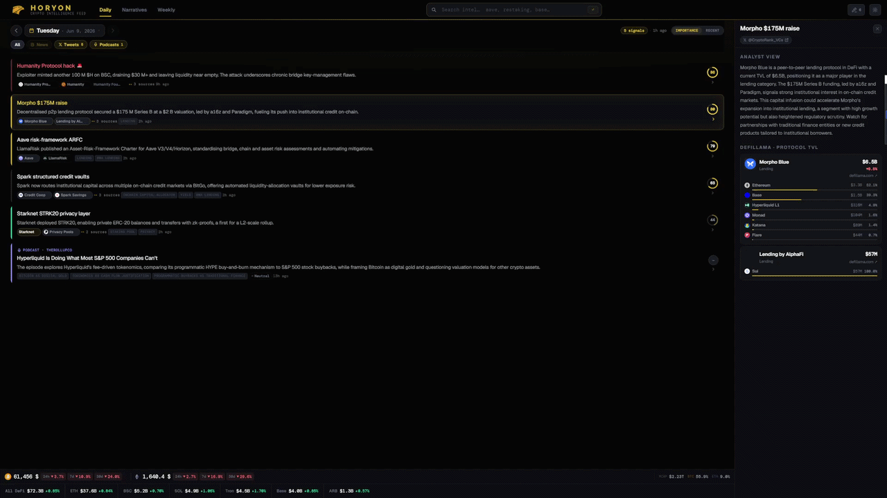

<div align="center">

<h1>
  &nbsp; Horyon
</h1>

**A personal crypto-intelligence system. It ingests around 100 news, X, and podcast sources every 20 minutes and applies an LLM pipeline to produce daily digests, narrative clusters, and an on-demand research agent.**

Available as a Telegram bot and a Next.js web application.


<br>



</div>

---

## Overview

Horyon collects content from approximately 100 RSS feeds, X accounts, and YouTube podcasts, stores it in PostgreSQL with vector embeddings, and uses a large language model to summarize, rank, and cluster it. Output is delivered through a Telegram bot and a web application that share a common backend. The system runs continuously and produces a digest each morning.

## Features

**Daily digest** — A summary of 5 to 10 items covering the previous 24 hours. Items are deduplicated against the prior week (a URL filter and a normalized-title fingerprint) and assigned an importance score from 0 to 100. Scoring is deterministic and combines six signals: source corroboration weighted by credibility, financial magnitude, appearance velocity, entity weight, keyword criticality, and novelty. No language model is involved in scoring, so the ranking is reproducible.

**Narrative clustering** — Signals from news and podcasts are resolved to entities, embedded, and grouped into persistent narratives. Each narrative carries a momentum state — forming, heating, steady, cooling, or dormant — derived from the ratio of recent activity to a trailing baseline.

**Research agent** — A ReAct agent answers free-text queries by searching the vector index and citing only retrieved articles. Frequently requested entities are served from a precomputed cache rather than the full retrieval loop.

**Podcast analysis** — YouTube podcast transcripts are retrieved without a paid API and summarized through a map-reduce LLM pass into a summary, key claims, and predictions. The extracted claims are fed back into the daily digest as candidate signals.

**Weekly report** — A Monday summary of market data, DeFi metrics, and the week's news, with continuity maintained across successive reports.

**Market and governance data** — DeFiLlama TVL and Snapshot governance proposals are retrieved on independent schedules and used to ground the analyses above.

## Design notes

**Grounding** — Each per-item analysis prompt receives two separate blocks: verified database facts (live TVL and governance records) and prior analyst notes (earlier model output). The two are kept distinct so an earlier inference cannot be presented as fact. Prompts prohibit inventing figures or dates.

**Provider failover** — LLM requests are issued against a chain of models (NVIDIA NIM, then OpenRouter), falling through on any error and retrying transient failures once. A single provider outage does not interrupt the daily run. The chain is implemented in both the Python service and the Next.js API routes.

**Output sanitation** — Some fallback models emit intermediate reasoning before their answer. Every persistence path strips it and rejects output that does not match the expected format.

**Retrieval** — Vector search uses pgvector with an ivfflat index and sets the probe count per query. Embeddings are 768-dimensional and generated locally with Ollama; input is truncated to the model's context window before embedding.

**Isolation** — Each post-digest enrichment step (scoring, narratives, briefs, podcast analysis) is independent and best-effort. A failure is logged and does not affect the digest.

## Tech stack

| Layer | Technology |
|---|---|
| Bot | Python 3.12, python-telegram-bot, APScheduler |
| Web | Next.js 14 (App Router) |
| Storage | PostgreSQL 16 with [pgvector](https://github.com/pgvector/pgvector) |
| Embeddings | Ollama, `nomic-embed-text` (768-dimensional, local) |
| LLM | NVIDIA NIM, then OpenRouter (OpenAI-compatible APIs) |
| External data | DeFiLlama, Snapshot (GraphQL), CoinGecko / CoinMarketCap, YouTube transcripts |
| Infrastructure | Docker Compose, Caddy (TLS and reverse proxy) |

## Architecture

```
RSS / X / YouTube  ──ingest 20m──►  Postgres + pgvector  ──►  LLM pipeline  ──►  Telegram bot
   (~100 sources)                    (embeddings, entities)     (digest /              + Next.js web
                                                                 narratives /
                                                                 agent / weekly)
```

The system runs as five containers under Docker Compose:

| Container | Role |
|---|---|
| `bot` | Telegram bot and the APScheduler jobs (ingest, digest, TVL, governance, podcasts, narratives) |
| `db` | PostgreSQL with pgvector |
| `web` | Next.js digest and narrative viewer |
| `monitor` | Flask status dashboard |
| `caddy` | TLS termination and routing |

See [ARCHITECTURE.md](ARCHITECTURE.md) for the full data-flow diagrams.

## Getting started

Requires Docker and Docker Compose, and an [Ollama](https://ollama.com) instance on the host with `nomic-embed-text` available.

```bash
cp .env.example .env          # provide API keys and secrets
ollama pull nomic-embed-text
docker compose up -d --build
```

Jobs can be triggered manually:

```bash
docker exec horyon-bot python3 -m app.digest        # build a digest now
docker exec horyon-bot python3 -m app.narratives    # rebuild the narrative layer
```

Local development without Docker:

```bash
python -m venv .venv && . .venv/bin/activate && pip install -r requirements.txt
python -m app.ingest --dry-run        # fetch and filter, no database write
python -m app.digest  --no-persist    # build a digest without storing it
```

## Project structure

```
app/        Python service — ingest, digest, narratives, scoring, research agent, podcasts, weekly, LLM client
web/        Next.js application — daily, narratives, and weekly views plus the research API routes
deploy/     schema.sql (authoritative database schema) and the Caddyfile
scripts/    operational helpers
docs/       design notes
```

## About

A personal project, developed and run as a single continuous deployment. API keys, hostnames, and credentials have been removed; `.env.example` documents the configuration required to run an instance.

## License

[MIT](LICENSE)
